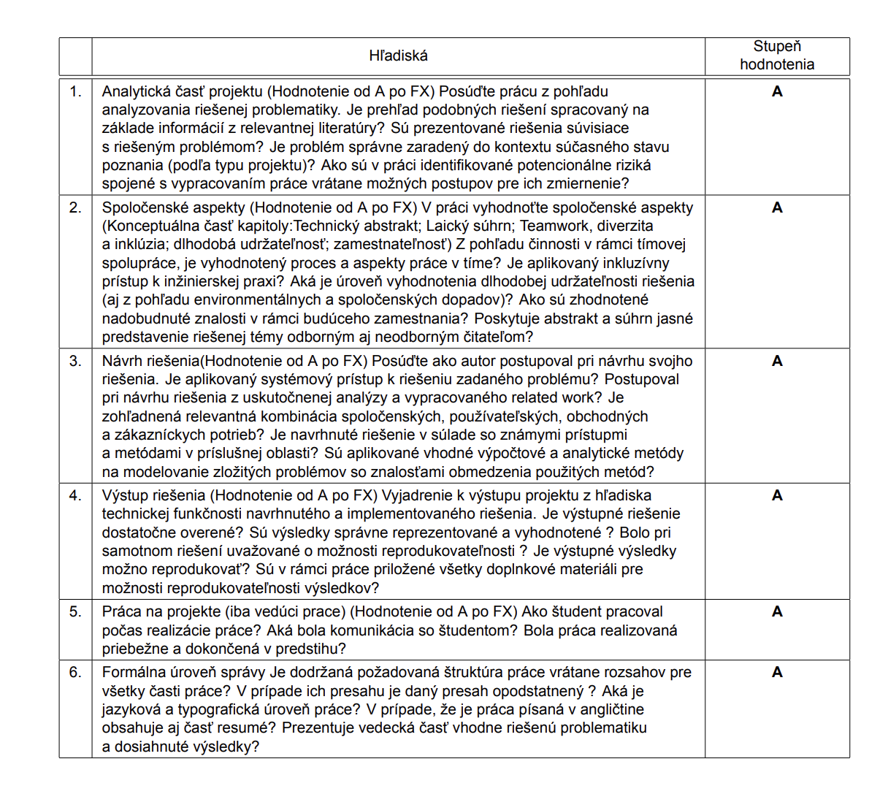
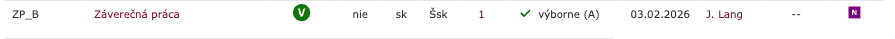

About template:
This template was created in accordance with the current requirements for bachelor's theses at FIIT STU, effective from 2024. Its structure and content have been agreed upon and discussed with my academic supervisor.

The thesis template is designed for use in Overleaf or Tectonic.
Before you start working, be sure to consult with your supervisor to make sure that the template meets the individual requirements of your thesis. Please note that the template is provided ‘as is’ and does not guarantee 100% compliance with all formal requirements. We will try to keep it up to date, but we cannot guarantee complete accuracy!!

Please also review the CHANGELOG.md file for recent updates and the LICENSE file for the licensing information.

A presentation template is also included to support the bachelor’s thesis defense before the committee.

If you would like to make improvements or corrections, I welcome any suggestions or you can read some ideas from ROADMAP. Please send pull requests or create issues!

TERMS OF USE:
Before using, please support the repository with a STAR on GitHub — this will help spread the template and motivate its further development!

⚠️ Important: using the template without fulfilling the above condition may be considered a violation of intellectual property rights. In extreme cases, I reserve the right to contact your educational institution with a corresponding notification.

\

Thesis and presentation were given an A grade, which speaks to the quality of this template ;)

